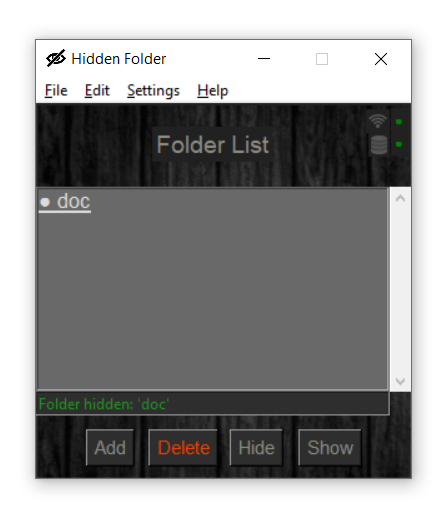
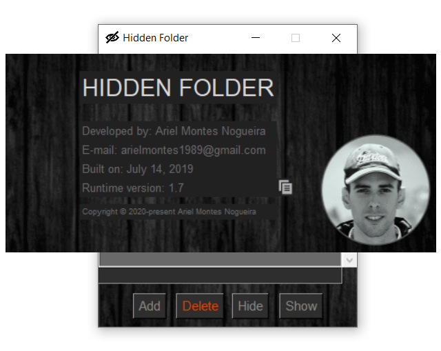
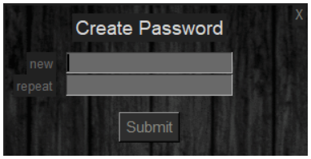
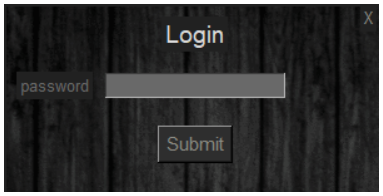
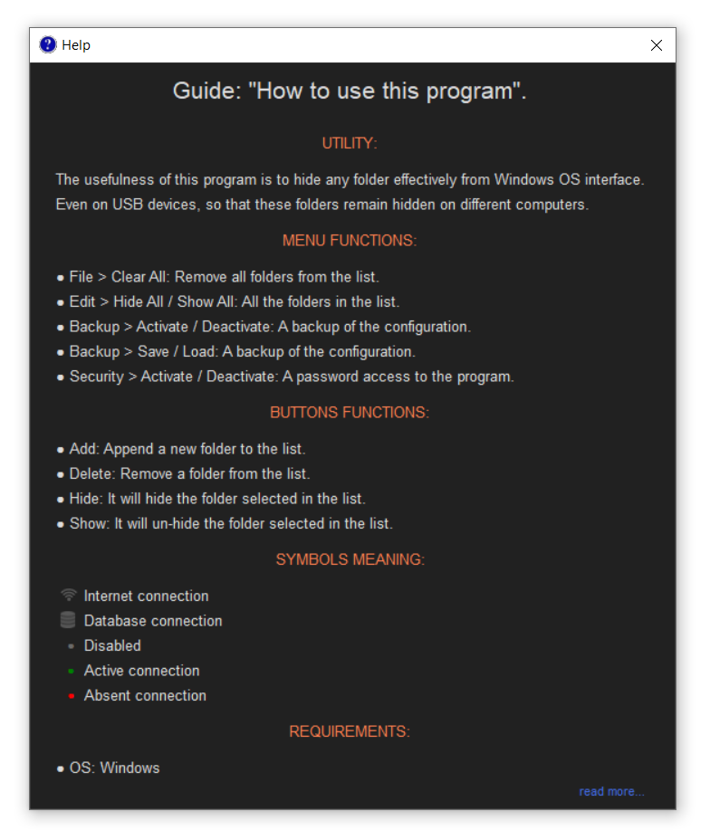

# Hidden Folder

## A program that hide folders efficiently from Windows OS interface.

 

### :cloud: Instalation

Download: [Hidden-1.7-setup.exe](https://github.com/Ariel-MN/Hidden_Folder/raw/master/Hidden-1.7-setup.exe)

 

### :information_source: Information

- **Requirements:** Windows OS, Python 3.7 or higer.

- **Python modules required:** _Pillow_**¹**, pymongo, dnspython, cryptography.

- **Repository:** I have added an installer, this file (\*.exe) has the purpose to create the necessary files in the correct place for the system to guarantee the correct functioning of the program, using this file you won't have to install anything else.  

  Note that to use the file "\*.py" directly it's necessary to install the Python interpreter and the libraries already cited above and read the [wiki](https://github.com/Ariel-MN/Hidden_Folder/wiki) and code of the script to understand how to use this program.

  The SHA256 hash sum for Hidden-1.7-setup.exe is:
   
  0c33ac830533420d07c4305c5a011bea27f0a605e1bb646adc40b5608e94ad0b
   
  Check it on [VirusTotal](https://www.virustotal.com): [Hidden-1.7-setup.exe](https://www.virustotal.com/gui/file/0c33ac830533420d07c4305c5a011bea27f0a605e1bb646adc40b5608e94ad0b/detection)

 

> **¹** Imported as "PIL" inside the script.

 

### Screenshots:

  
  
   
  
  
   
   
  
  
  
  
     
   
  
  

